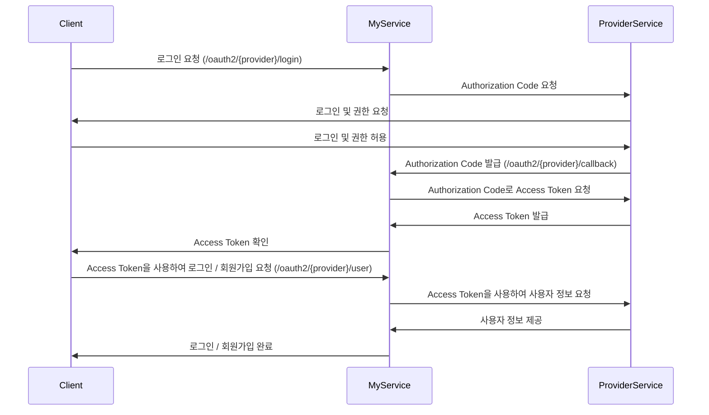

# Sequence diagram

```mermaid
sequenceDiagram
    participant Client
    participant MyService
    participant ProviderService
    Client ->> MyService: 로그인 요청 (/oauth2/{provider}/login)
    MyService ->> ProviderService: Authorization Code 요청
    ProviderService ->> Client: 로그인 및 권한 요청
    Client ->> ProviderService: 로그인 및 권한 허용
    ProviderService ->> MyService: Authorization Code 발급 (/oauth2/{provider}/callback)
    MyService ->> ProviderService: Authorization Code로 Access Token 요청
    ProviderService ->> MyService: Access Token 발급
    MyService ->> Client: Access Token 확인
    Client ->> MyService: Access Token을 사용하여 로그인 / 회원가입 요청 (/oauth2/{provider}/user)
    MyService ->> ProviderService: Access Token을 사용하여 사용자 정보 요청
    ProviderService ->> MyService: 사용자 정보 제공
    MyService ->> Client: 로그인 / 회원가입 완료
```